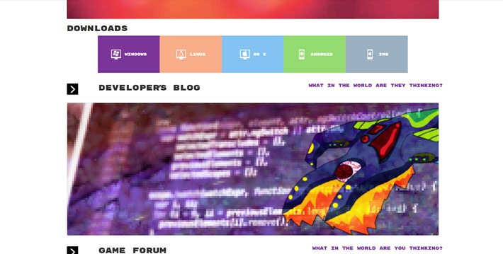
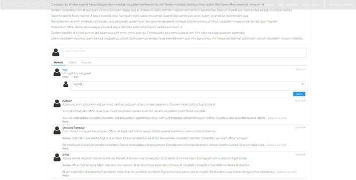
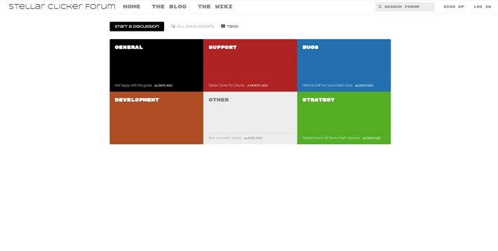

# Stellar Clicker Website

> [!WARNING]
> Archived and no longer maintained; kept for reference. Written in 2016 for Laravel 5.2 and PHP 5.5, and bundles a beta version of Flarum. All of these are end-of-life, and the site (stellar.polymorphixgaming.com) is no longer online.

## Overview

The website, blog, and forum for [Stellar Clicker](https://github.com/angiebrr/um-csci412-stellar-clicker), a clicker game my team made for CSCI 412 at the University of Montana in spring 2016.

**Tech:** PHP 5.5, Laravel 5.2, Sentinel, jQuery, LESS, Bootstrap, Gulp, Flarum (beta), MariaDB, Mailgun, CentOS 7

### What I built

- The Laravel app: routes, models, schema, seeders, Blade views, JavaScript, and LESS
- Authentication with Sentinel
- A developer blog where bloggers post in Markdown and readers can comment
- A Flarum forum in `flarum/`, with plugins like image uploads and media embeds and a theme adjusted to match the main site
- The CentOS 7 server it ran on, down to the virtual hosts for each subdomain

Matthew Dolan filled in some of the blog and user management controllers, and he tried out several self-hosted wikis before we settled on a Wikia page embedded in an iframe.

## Screenshots

